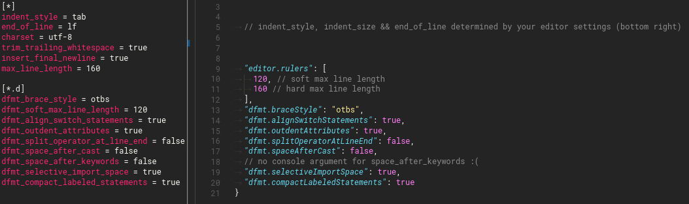

<h2 align="center">code-d changelog</h2>

<table align="center">
<tr>
<th>Join the Chat</th>
<th>Donate</th>
</tr>
<tr>
<td align="center">

[](https://discord.gg/Bstj9bx)

Discord chat

</td>
<td align="center">

[](https://github.com/sponsors/WebFreak001)

Donate for faster
<br>
development on
<br>
code-d and serve-d

</td>
</tr>
</table>

# 0.x.y

## Single-File editing

code-d can now be used without open workspace to edit singular D files.

## Debugging

code-d now ships with a debug launch type, which is a wrapper for various debugging extensions. Currently supported debugging extensions are:

- Native Debug (webfreak.code-debug)
- C/C++ (ms-vscode.cpptools)
- CodeLLDB (vadimcn.vscode-lldb)

Through this it is possible to create a single platform-independent, extension-independent debug configuration, which can be used and shared in most projects without changes.

Refer to the new [Debugging section](docs/debugging.md) in the user guide to see how to use this new feature.

## Building

Tasks implementation has been improved and the documentation has been overhauled. The documentation now better shows that `Ctrl-Shift-B` is for configured tasks only and not to list all available DUB tasks. `_generated` has been removed.

Building projects in subdirectories have been fixed.

## Usability

Several improvements to warning/error diagnostics have been made. While editing syntax errors are now properly marked as error instead of as warning and have better locations.

Improved examples:
```d
void foo() {
    writeln("hello")
}
```
will now show the missing semicolon error at the end of the line.

```d
if (myObject == null) {}
```
will now mark the `==` as error for the "use `is` instead of `==` when comparing with `null`" error message. There is also now a quick fix available to automatically fix this issue quickly.

```d
foreach (auto key; value) {}
```
while looking nice is not valid D code. The syntax error will now properly explain that the `auto` is wrong and suggest removing it with a quick fix.

Among several other improvements of error locations, without any new quick fixes. The experience for newcomers has especially been improved by this.

## D-Scanner

The following D-Scanner warnings have been disabled by default:
- Public declaration '...' is undocumented
- Variable ... is never modified and could have been declared const or immutable.

For big projects these fields are still recommended and this only applies to projects without any dscanner.ini.

To revert to the old behavior, edit or create a file called `dscanner.ini` in your project root and run the "Insert default dscanner.ini content" command (Ctrl-Shift-P) to be able to enable/disable all fields.

The "Insert default dscanner.ini content" command now dumps the currently used settings for code linting instead of a static file. This is useful to start off with the current settings instead of overriding to some different values.

## Formatting

You can now format just the current selection of code. Thanks to @ryuukk for implementing this. ([Pure-D/serve-d#120](https://github.com/Pure-D/serve-d/pull/120))

Additionally dfmt (the included formatter tool) was upgraded from 0.11.0 (last serve-d stable) to 0.13.4, introducing a lot of fixes and improvements.

## DDoc

A regression that auto completion was missing formatting has been fixed.

Additionally now a lot of phobos functions look a lot better and references `$(LREF localSymbol)` and `$(REF symbol, std,package)` properly display now. Also all unknown macros are now visible.

Example of full `writeln` ddoc detail now:

<div style="padding: 0.2em 1.5em; background-color: rgba(0, 0, 0, 0.2)">

Equivalent to `write(args, '\n')`.  Calling `writeln` without
arguments is valid and just prints a newline to the standard
output.


**Params**

`args` the items to write to `stdout`

**Throws** — In case of an I/O error, throws an `StdioException`.

**Example**

Reads `stdin` and writes it to `stdout` with a argument
       counter.


```d
import std.stdio;

void main()
{
    string line;

    for (size_t count = 0; (line = readln) !is null; count++)
    {
         writeln("Input ", count, ": ", line);
    }
}
```

</div>

## Tutorial

The [Debugging section](docs/debugging.md) in the User Guide has been updated to include the selection and installation of a debugger used for D.

## Settings Contexts

You can now use new context variables in `when` clauses in vscode settings like keyboard shortcuts. Added are:

- `d.isActive` which is true once code-d has been started (user ran some code-d command, opened a D file, wants to debug, has dub.json/dub.sdl, etc.)

## Other Things

Minor Changes:
* the "insert dscanner.ini" command now inserts the exact current D-Scanner config for the document instead of some hardcoded one to simplify changing it.
* Running the predefined tasks will auto focus the console now. If you want to do this to your own tasks as well, set `"presentation": {"focus": true}`

# 0.22.0

## dub

Platform attributes on supported values in dub.sdl are now autocompleted. This includes all the [current](https://github.com/dlang/dub/blob/8ffc09ed6fb9625837161ffbbda2d926f490196c/source/dub/platform.d#L24) platforms, architectures and compilers.

Furthermore dependencies complete better now when completing in the middle of a word.

When creating new dub.json and dub.sdl files, the name and syntax boilerplate will be inserted.

User experience when saving dub.json/dub.sdl files has been improved.

## Snippets

Snippets have been completely overhauled and now complete properly based on code grammar. Additionally some snippets (foreach, foreach_revese) can automatically determine default variables now to iterate over which can help you typing the name of big arrays and lists.

There are also new snippets specific to dub packages. These snippets will only be suggested if the workspace has the required dub dependencies installed. Built-in dependency based snippets are the vibe-d snippets `viberouter`, `vibeserver`, `vibeget`, `vibegettext`, `vibegetjson` and `vibepost`. Additionally there is a [new API in code-d](https://github.com/Pure-D/code-d-api) for other third party VSCode extensions to provide their own dependency based D snippets.

## User Guide

There is a new user guide including tutorials and information about all the code-d features. Use `Ctrl-Shift-P -> Open User Guide` to open. (will open automatically for new users first time)

## Quality of Life improvements

There is a new startup progress bar in the status bar while serve-d is initializing all projects and dependencies.

You can now right-click on symbols and press `Search in dpldocs` to look up documentation for anything online much quicker. You can also bind this to a keyboard shortcut in your keyboard bindings and quickly search wherever the code cursor is.

Syntax highlighting was improved

* otbs style D code was improved a lot. (fixes `if`, `while`, `for`, `foreach`, `switch`, `final switch`, `with`, `synchronized` and `catch` blocks with braces on same line)
* `typeof` highlighting
* `asm` block fixes
* fixed delegate highlighting without arguments

## Other things

The custom serve-d commands and initialization have all been documented in the README for custom LSP clients in other editors.

The serve-d installer has been refactored a lot, please report any issues in case of any failures with OS & release information!

Minor Changes:
* `~~deprecated~~` and `unused` variables warnings will now be rendered using the standard vscode formatting
* Removed upload code selection feature. Use a dedicated extension for this instead. (for example "Share Code" `rolandgreim.sharecode`)
* Sort imports is now bound to `Ctrl-Q Ctrl-S` by default.
* The changelog now opens in every new version. Add `"d.showUpdateChangelogs": false` to disable.

Bug Fixes:
* Fixed sorting imports inside functions sometimes replacing commented imports.
* Fixes build tasks on windows with CMD

# 0.21.0

## New release mechanism

The `d.betaStream` setting is now obsolete and got replaced by `d.servedReleaseChannel`.

`d.servedReleaseChannel` offers 4 different modes:

- `stable`: this behaves like previously having `d.betaStream` set to false but additionally now will always fetch newer releases directly from GitHub without a new code-d being needed to be installed first.
- `beta`: this is a new option which behaves much like `stable`, but additionally to the release builds from GitHub also downloads the pre-release versions. These can be considered mostly stable and will be released in more frequent update iterations. Pick this release channel if you want to report extension issues early.
- `nightly`: this option behaves similar to `d.betaStream` set to true. However now only pre-compiled versions will be downloaded and additionally these versions are only released past midnight UTC and only if all tests pass. This new option combines the fast iterations of betaStream with more stable releases that will not cause compilation errors.
- `frozen`: this option completely disables the update check on GitHub and only uses the locally installed serve-d. However if serve-d is not installed or broken, code-d will still attempt to download it from the newest stable version.

## Diet templates

Diet completion got a lot of bug fixes and will work a lot better with more D code now.

Adding
```
//-context=app.d
```

where `app.d` is the primary file in which the template is used will result in improved completion. This comment must be the first token of the file (or second line if first is extends) and the context file must have been opened.

For this serve-d will search for a string using the diet template filename (without folder, but with extension) in the code.

Currently this is not enabled by default because it is still completing too many symbols which aren't even accessible. To enable it anyway, set `"d.dietContextCompletion": true` in your user settings.

## More & improved code actions

Implement interface got even more stable and now uses snippets to quickly navigate between implemented methods. It also now puts all methods at the bottom of a class instead of at the top. For default implementations sometimes you can also pick between multiple implementations.

## DUB

Dub errors now report and disappear much more consistently and have had extreme performance improvements. Template instances will be reported both in calling parts in your projects and where the error actually instantiated first. All error messages will now properly show the following error messages as location markers when hovering over the root cause and suggest only jumping there instead of marking them as invalid.

Saving a file with dub linting enabled will also no longer run the pre/post build commands and only update errors in the current dub project. To show errors in other projects save files in other projects.

## Settings Contexts

You can now use new context variables in `when` clauses in vscode settings like keyboard shortcuts. Added are:

- `d.hasDubProject` which is true if there is a project with dub enabled (when the dub outline is visible)

## Other Things

DCD upgrade to 0.11.1

Minor Changes:
* DCD now downloads with a rich download UI in newer code-d and with console progress bar in older code-d or other editors
* Import paths are now much better resolved if dmd is installed. They will use a very accurate search on Posix platforms using dmd.conf and on windows relative to the exe path. Also per-project overrides using dmd.conf are possible with this.
* Added `d.lintOnFileOpen` with possible values `"always", "project", "never"` which controls whether files should be linted with DScanner when opening. (defaults to "project") To revert this to always lint every file, including phobos and other libraries, change it to `"always"`
* Files external to the project no longer persist linting warnings when closing anymore.
* Added `$dmd` problem matcher to build tasks.

Bug Fixes:
* **Build tasks now finally work properly**
* The statusbar now only loads once dub is ready.
* Some memory optimizations and segfault fixes.
* Dub build task doesn't break anymore for not loaded workspaces.
* Some threading issues fixed which previously caused random crashes.
* Unreadable directories don't crash serve-d startup anymore.
* Fixed several "Sort imports" bugs.
* Module name insertion properly takes the longest import path now for determining the module name, so it will always insert the shortest module name for your imports.
* When uninstalling code-d an uninstall script deleting the code-d folder should run now.
* Code actions now properly show on all characters on diagnostics instead of just the first character.
* DML autocompletes again
* Installation will no longer silently halt if dependencies aren't installed
* Serve-D installation will now fall back to x86 if x86_mscoff isn't available (fixes installation if only LDC is available)
* Fixed DCD stdout error message box on Windows on shutdown
* Sorting imports now supports `public import` and `static import` and will also sort those before the other imports.
* Fixed code coverage highlighting on Windows

# 0.20.2

When compiling serve-d from source, don't inline (fixes fatal OSX bug)

# 0.20.1

Upgrade serve-d to 0.4.1, fix installation of serve-d and DCD deleting itself.

# 0.20.0

## Invalid dub configurations and dependencies don't fatally crash serve-d anymore.

You can now just fix your syntax mistakes and save the file again (or maybe twice for good measure) and it will magically just start working again!

Dependency issues also no longer cause issues as they are now loaded and upgraded in-memory if there are any missing, keeping your working directory clean while making sure that everything is working.

## Embedded Documentation View

Don't open your browser to browse phobos and other project documentation anymore.

You can now browse through the online documentation of Phobos and all your dub dependencies using the new embedded documentation browser powered by [dpldocs.info](https://dpldocs.info).

Just open up your command palette and search for `Search dpldocs for Phobos & Dependency documentation` or press `Ctrl-Q Ctrl-Q` by default. You can also map this to a keyboard shortcut to make this even easier to access.

This is a really useful command, try it out!

## Diet templates

vibe.d Diet templates have gotten a lot of love.

New features include:

* Auto-Completion + Calltips of D code inside diet + HTML Tag & Attribute Name & Value completions
* Proper language config (autoclosing quotes)

## New Syntax Highlighting

If you were often frustrated with how random the old syntax highlighting was, it has now been made a lot more consistent and less buggy in general.

Check out a comparision on https://twitter.com/WebFreak001/status/1079446928256053249

## Implement interface improvements

The implement interface code action will no longer insert duplicate code and a lot more tests have been added to ensure correctness.

If you do OOP, try it out by simply extending an interface or abstract class and going on the inherited symbol with your cursor.

## Completion improvements

If you have `d.argumentSnippets` enabled, you will now have a much cleaner experience. Types and default values are no longer passed inside the snippets, so only variable names are put in inside the function arguments.

This makes it much easier to especially write OOP code or code where your variables are often called the same thing as the arguments.

Additionally autocompletion no longer shows duplicates of the same symbols. The documentation and definition of all symbols with same name, kind are merged into one for the autocompletion.

You can revert this back to a slightly modified version using `"d.completeNoDupes": false`, symbols with same name, kind and definition are always merged now however.

## Convert between dub JSON and SDL

You can now convert dub package recipes between JSON/SDL using a click on the convert button in the toolbar or by running the "Convert between dub.json/dub.sdl" command while having the recipe open. You can still undo after conversion if it missed something or you noticed you had comments it removed.

## Other Things

The server now tries to restart more. It now only doesn't restart after 20 restart fails in one minute instead of 5 fails in 3 minutes.

Implemented proper outline view and with that also breadcrumbs. See [#201](https://github.com/Pure-D/code-d/issues/201)

Fixed an SDL parsing issue with comments not consuming line endings. Comments won't affect parsing of the next line anymore.

When opening a file, it will get linted by D-Scanner immediately.

serve-d upgrade to 0.4.0

DCD upgrade to 0.10.1

Coverage and GC decorations (red/green background tint and allocation code lenses) can now be toggled with the new `d.enableCoverageDecoration` and `d.enableGCProfilerDecorations` settings respectively. Coverage will always still show in the statusbar.

Status bar items will now only be shown when a D file is opened. You can revert this to the old behaviour by setting `d.alwaysShowDubStatusButtons` to `true` in your user or workspace settings to bring back dub buttons and you can enable `d.alwaysShowCoverageStatus` to do the same to the coverage status indicator.

The installation of DCD is fixed and reloading after installation is no longer required.

Minor stuff:

* removed long gone dscannerPath and dfmtPath from the settings (as they are integrated into serve-d and have been ignored ever since)

# 0.19.0

* Workspace symbol search now shows all symbols starting with the search query.
* DScanner issues can now be disabled per workspace and per line of code (using `@suppress(all)`, `@suppress(dscanner.xxx)` or `@supress(xxx)` in the same line as the issue, a code fix helps removing it)
* Build tasks replace the old compile buttons in the status bar (Ctrl-Shift-B)

serve-d upgrade to 0.3.0

# 0.18.1

Fixed fsworkspace provider and `d.extraRoots` not working. (serve-d update to 0.2.1)

# 0.18.0

## Update to workspace-d v3!

This release finally includes multi workspace support. You can manually add instances using the new `d.extraRoots` setting and prevent automatic instance detection partially using `d.disabledRootGlobs` or disable it fully using `"d.scanAllFolders": false` to get back to the old behaviour (but still with working multi-root workspaces).

Some bugs may occur and some old ones may have been fixed during this transition. Please report issues to the [code-d github repository](https://github.com/Pure-D/code-d/issues).

Project dependent settings such as the status bar buttons or the dub dependencies are linked to the project containing the file you are currently editing.

Minor things:
* Dependency upgrades (dub to 1.10.0, dfmt to 0.8.2, dscanner to 0.5.7)
* Settings are now properly categorized for multi-workspace projects and some settings can be set in all cases and some only in user settings.
* DCD is now fetched from the official github releases (0.9.9)
* dub.json completion now properly inserts quotes
* some dub startup errors were fixed
* import timing takes into account possible second-run optimizations.
* some requests in code-d were previously decoded wrong, causing silent ignoring of some configuration and parameters. This has been fixed with a single character.

# 0.17.2

Fixed a bug where `d.betaStream` would have recloned serve-d on every startup if the latest commit has been made on a 10th of any month or later or if the last digit of the current compiled serve-d date was less than the commit date.

Upgrade language client to 4.1.3

# 0.17.1

DCD Installation fixes, especially on windows.

# 0.17.0

The switch to serve-d / Microsoft Language Server Protocol!

* Added dub dependencies view in the UI that shows a dependency tree in the currently opened project
* New syntax highlighting using [ysgard/d-struct](https://github.com/ysgard/d-struct) grammar
* automatic module naming: when you rename a file you are currently in or create a new file a module statement will be added/changed
* the English, German and Japanese translations are finally used! Thanks to @SeijiFujita for the Japanese translation
* dfmt and dscanner are now included in serve-d and workspace-d and no longer need to be installed
* Fancy new ddoc renderer when hovering over symbols
* Live DScanner linting: you get errors from dscanner while you type now
* dscanner.ini auto completion of sections, fields & values
* ddoc auto completion: press ctrl-space before a function definition and select the /// or the /** completion option to get a documentation template with arguments and sections
* added sort imports command only sorting the "block" (separated by whitespaces) and not all imports in the file for more user control (but not compatible with the dscanner sortedness linting)
* When autocompleting functions automatically insert the signature as snippet which can be navigated using tab. (configuration d.argumentSnippets)
* Automatically implement classes and interfaces using the new `Implement selected interface/base class` command or by using the code actions
* All imports are annotated with a code lens to show how long they need to import. For this just a dmd call using just the import is called multiple times (up to 500ms per import).
* DCD Compilation is fixed (especially on windows)

Minor changes:
* Installing dependencies uses the dubPath setting now for dub
* dub.json auto completion was broken in an vscode update, should work again now
* Added `d.enableStaticLinting` & `d.enableFormatting`
* Dub installer upgraded to 1.4.0
* Dependent programs are now installed without user confirmation by default
  * Use `"d.aggressiveUpdate": false` to disable this behaviour.
  * On linux files are installed into `~/.local/share/code-d` or as fallback (and also on mac) into `~/.code-d`. On Windows files are installed into `%APPDATA%/code-d`
* Will now install dub before trying to compile dependencies
* If no D compiler is present the browser will be opened on the D download page
* Dedicated output channel in the output tab for error messages & alike
* Current parameter in calltips is more exact now
* Goto definition got more efficient

# 0.16.2

* Fix dub.json/dub.sdl snippets on vscode 1.13.0 and above

# 0.16.1

* Auto-fix broken tool paths when upgrading code-d

# 0.16.0

* Fixed windows dscanner exe path
* Fixed goto definition in unopened files
* Better default stdlibPath values (platform dependent) + snippets for it
* Import fixer will suggest stdlib & works with UFCS
* Bump to workspace-d 2.10.0
	* Primarily makes importer better
	* Finds outdated DCD/Dscanner/dfmt now (warnings/update not yet implemented in code-d)

# 0.15.1

* Fixed installation on macOS

# 0.15.0

* Installer uses the http.proxy settings now
* Better error checks for invalid executables
* "line is longer than" error now starts at the correct column
* Fixed installer with portable/custom git/vscode installation
* Auto fix for suggested imports from compiler
* Dscanner symbol search fix for missing symbols from compiler

# 0.14.2

* File paths from any custom error messages generated using pragma(msg) will get checked through string import paths now to fix file names (for example compiling diet template files will have the correct path now)
* Running a dub build for linting when a diet file is saved

# 0.14.1

* Switched from .editorconfig to vscode user settings for dfmt formatting settings.
* Updating workspace-d when outdated

## Moving to new vscode dfmt settings


