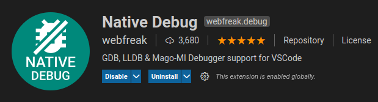
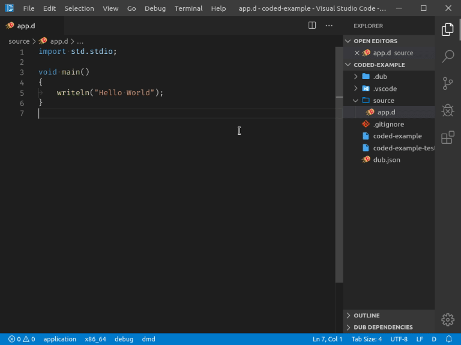
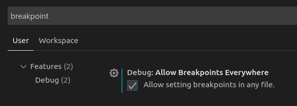
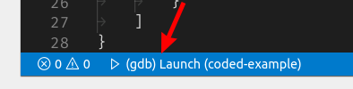

<!-- Documentation generated from docs-src/debugging.md -->

# Tutorial

<div style="float: right; margin-left: 1em; padding: 1em; border: 1px solid white; position: relative; z-index: 10; outline: 1px solid black;">

* [Home](index.md)
* [Installation](install.md)
* [Tutorial](intro-to-d.md)
	* [Intro to D](intro-to-d.md)
	* [Hello World](hello-world.md)
	* [Building](building.md)
	* **[Debugging](debugging.md)**
	* [Editing](editing.md)
	* [DUB Package Manager](dub.md)
	* [vibe.d Web App](vibe-d.md)
	* [Configuring non-DUB projects](non-dub.md)
* [Troubleshooting](troubleshooting.md)
* [Changelog](../CHANGELOG.md)

</div>

## Debugging

code-d itself does not provide any debugging capabilities, you will have to install a debugging extension from the marketplace.

However code-d does provide the build tasks which can be used before debugging so the run button also rebuilds the project.

For this you have multiple options:

You will either want to install the C/C++ extension by Microsoft:


* Good issue support

* Regularly updated

* Debugging using GDB, LLDB and the Visual Studio Debugger

* Supports lightweight natvis and threads

* Can show more variables/scope

If you are on Windows, this is definitely the Extension you want to install so you can use the Visual Studio Debugger, which works without any problems.

**Note: you will have to enable breakpoints for all files for D to work with the C/C++ extension**

or you will need to install the Native Debug extension:



* Zero-Configuration D support

* Debugging using GDB, LLDB or mago-mi

* Some better remote debugging support

------------

Depending on extension you choose to use you will need to check their documentation how to setup everything.

## Creating a debugging configuration

Open the debug panel and click the cog. Select your installed debug extension and replace the path to the executable to your executable generated in the [Building](building.md) step.



See the [Visual Studio Code documentation](https://code.visualstudio.com/docs/editor/debugging) for more information.

**NOTE:** if you are using the **C/C++ Extension** you will have to go into your User Settings (`Ctrl-Shift-P -> User Settings`) and enable "Allow Breakpoints everywhere":



## Building before every debug run

First you will need to add a label to your [task definition](building.md#custom-build-tasks):

```js
{
	"label": "dub build", // <-- add a good name here
	"type": "dub",
	"run": false,
	"problemMatcher": [
		"$dmd"
	],
	"group": "build"
}
```

Now in your debugging configuration, add a `"preLaunchTask"` with your given label:

```js
{
	"version": "0.2.0",
	"configurations": [
		{
			...,
			"preLaunchTask": "dub build"
		}
	]
}
```

When you now hit debug, it will automatically build your application before building. When no sources are changed this is done very quickly.

You can now also debug using the button in the status bar:



## Next Steps

Using the various [Editor Functionalities](editing.md)
