<!-- Documentation generated from docs-src/editing.md -->

# Tutorial

* [Home](index.md)
* [Installation](install.md)
* [Tutorial](intro-to-d.md)
	* [Intro to D](intro-to-d.md)
	* [Hello World](hello-world.md)
	* [Building](building.md)
	* [Debugging](debugging.md)
	* **[Editing](editing.md)**
	* [DUB Package Manager](dub.md)
	* [vibe.d Web App](vibe-d.md)
	* [Configuring non-DUB projects](non-dub.md)
* [Troubleshooting](troubleshooting.md)
* [Changelog](../CHANGELOG.md)

## Editing

### Basic

#### Auto-Complete

code-d provides you with auto completion for nearly all use-cases. Simply trigger it by hitting `Ctrl-Space` to view available variables, types and snippets.

Note that there may be more items than what is completed but due to the nature of the auto completion engine used, possibly not all variables and functions will be shown. (Especially when trying to use global methods using UFCS)

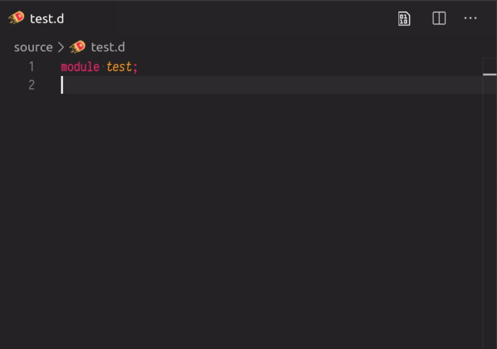

#### Linting

While typing, code-d will automatically do static style checks on your code and warn you of possible bad code conventions.

If you get a wrong warning it's possible to disable the warning per line or per workspace. Simply move the cursor on the affected line and click the ignore code action.

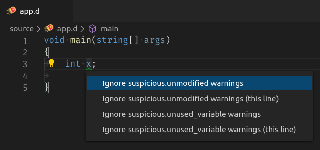

Additionally if working in a DUB project and after saving a file code-d will parse the project with the compiler to find all syntactical and semantic issues.

#### Formatting code

It's always possible to format the entire code file to be neat again.

At this point, press `Ctrl-Shift-I` or `Alt-Shift-F` (depending on your platform) or `Ctrl-Shift-P -> Format Document` to reformat the entire code:

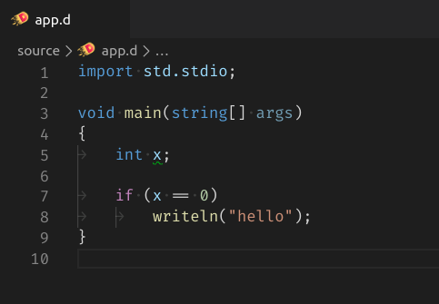

Sometimes it may not be desirable to reformat your carefully indented block of code. To avoid reformatting certain areas in your code, simply surround them with `//dfmt off` and `//dfmt on`:

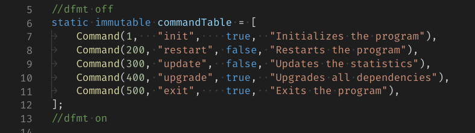

### Navigation

#### Go To Definition

`Go To Definition` is one of the simplest commands to navigate around in code. It's very useful to lookup documentation or edit the implementation of a function.

Simply move the cursor on the function, variable, type or import you want to look up and press `F12` to go to the definition. (Or `Ctrl-Shift-P -> Go To Definition...`)

#### Outline & Breadcrumbs

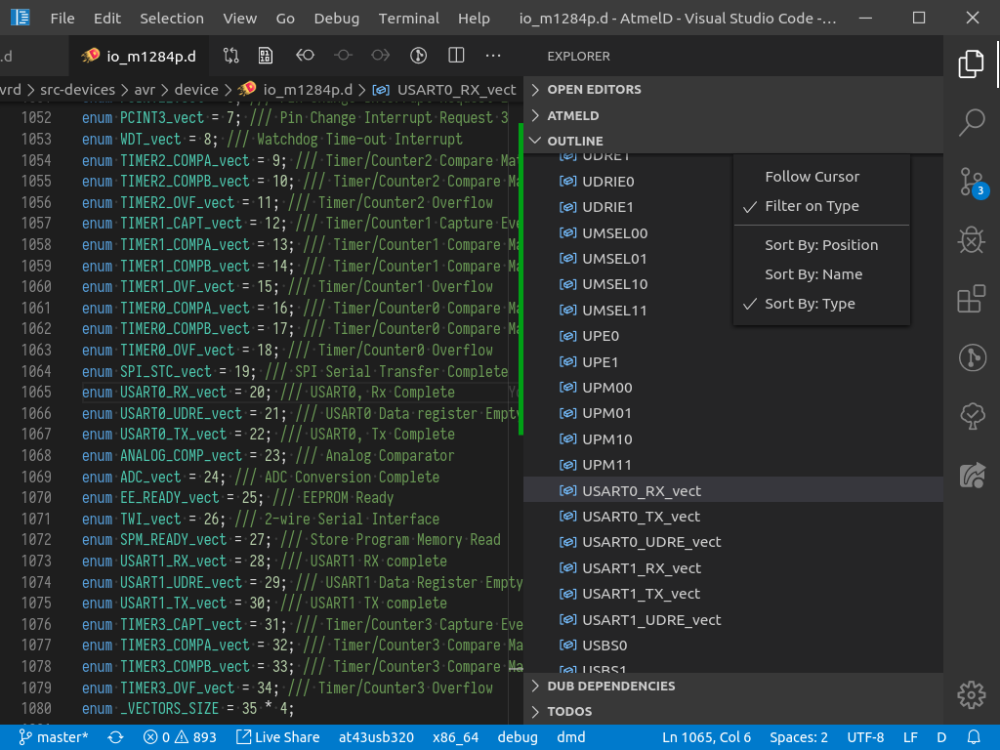

The outline can be a great way of quickly glancing over the entire file structure of any opened file.

It lists all types in a hierarchical or alphabetical order and can also be configured to follow the cursor.

Additionally the outline is shown in the breadcrumbs at the top of the file (if enabled in user settings):

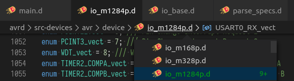

It is possible to navigate folders, files and symbols using this and is very convenient for mouse users and presentations.

#### Search symbols in the current file

An extremely useful command is the "Go To Symbol in File..." command (`Ctrl-Shift-O`) which is a very quick and efficient way of navigating around in a file.

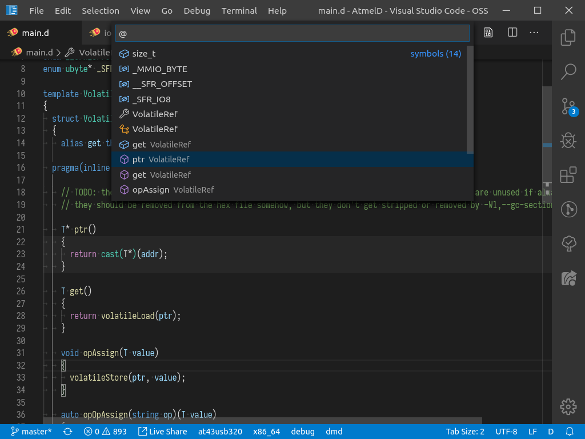

It can be easily triggered using the hotkey, navigated around in and it will automatically change the cursor focus where you go to. It can also be seen as position sorted outline to quickly glance over.

#### Search symbols through the whole project

Using the "Go To Symbol in Workspace..." command (`Ctrl-T`) the whole project can be browsed for any given symbol.

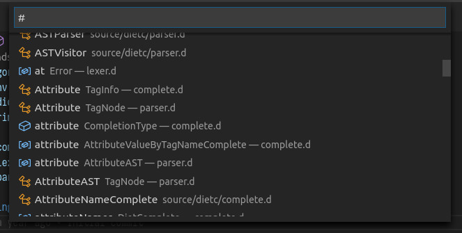

This can be useful to quickly navigate to other symbols with same name or to view all symbols in the entire project. Note that this can be slow especially in big projects as it will also show some symbols from dependencies if searched for.

#### Search for online documentation

Sometimes it might be useful to search for the whole documentation page of a symbol. code-d provides searching [dpldocs.info](https://dpldocs.info) to search any identifier in Phobos and all used DUB dependencies.

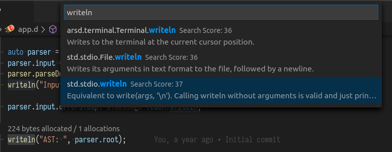

This can be triggered by `Ctrl-Q Ctrl-Q` (or `Ctrl-Shift-P -> Search dpldocs`) and will perform an online search for the symbol. The advantage of this is that there are links and examples all in very readable format.

It's also possible to select a symbol and then press `Ctrl-Q Ctrl-Q` to automatically fill out the search query with it.

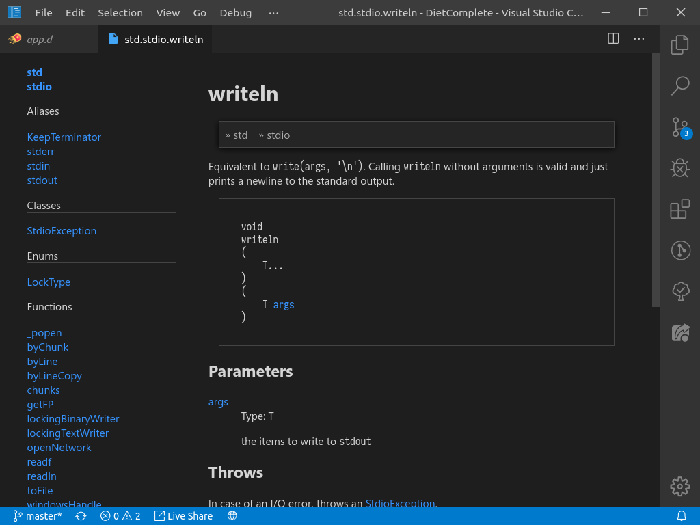

The result will then be embedded into the editor. It's possible to click "See Implementation" to jump to the source code in VSCode and click all the types to navigate around on the embedded dpldocs page.

It's also possible to rightclick at any point in code and lookup the documentation of the identifier at a given location.

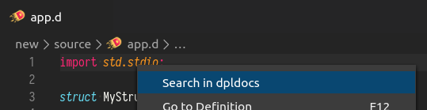

### Refactoring

#### Sorting Imports

When you have a group of imports and want to alphabetically sort them first move your cursor anywhere inside the import block:

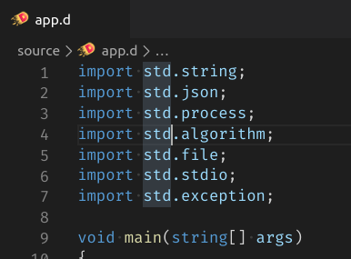

then hit `Ctrl-Q Ctrl-S` (or `Ctrl-Shift-P -> Sort Active Import Block`)

#### Implement Interface

When you have a class and you want to implement an interface or an abstract super class, simply move your cursor on the class you want to implement and hit the light bulb (`Ctrl-.`) to see the implement interface action.

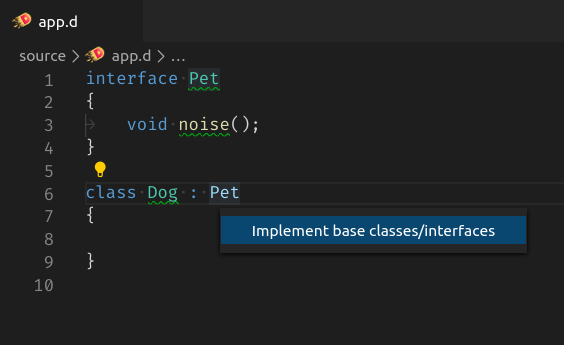

#### Auto Import

If the compiler suggests a missing import for any function, it will be offered to import it.

Click on the error message or move your cursor to it and then hit the light bulb (`Ctrl-.`) to view available actions.

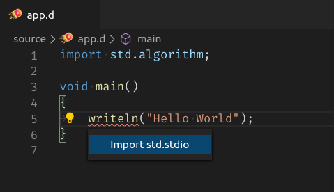

In the future this will work with more imports than just the suggestions.

---------------

## Other Editor Features

### Auto Completion & Calltips

The auto completion is available for dub.json files, dub.sdl files, dscanner.ini files, D files, DML (DlangUI Markup Language) and Diet files (vibe.d templates)

Call tips can be shown when calling functions inside D and Diet files, which show inline docmuentation and the function arguments.

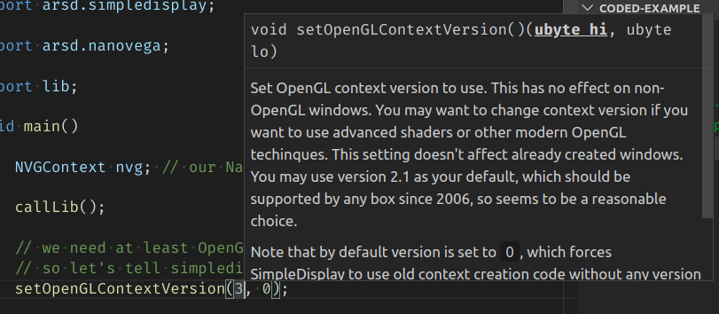

Hovering over symbols will also show this documentation. Additionally holding ctrl will show definition and make it able to jump to the definition.

Auto completing inside documentation comments in D files will trigger auto completion for DDOC comments:

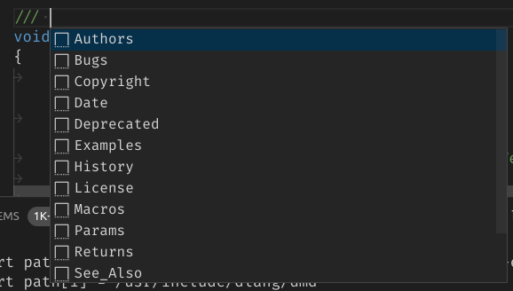

Right before a function definition typing `///`, `/++` or `/**` and auto completing it will trigger auto completion of a full placeholder for documentation of the function:

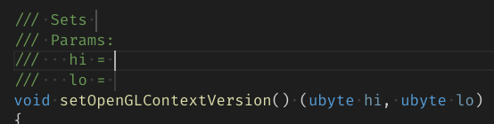

When completing snippets, it is possible for third party extensions to provide custom D snippets auto completing at specific grammatical scopes and only when certain DUB dependencies are active in the workspace.

### D Import timing

It's possible to show how long each import takes in compile time by enabling the `d.enableDMDImportTiming` setting. However this only gives very rough estimates, depends on constant system performance to be useful and can degrade performance so it's not enabled by default.

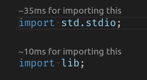

### Coverage analysis

If there are .lst files in the project, either generated with DUB using the build types `unittest-cov` or `cov` or generated using the compiler flag `-cov`, then all files with coverage files will have slight green/red background decorations behind each line:

Additionally in the status bar it will show a button where it shows the coverage of the currently opened file:

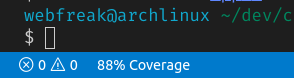

When clicking this a summary of the covered lines is opened. (currently disfunctional)

### GC profiling

If there is a profilegc.log file generated by dmd in the project, either generated with DUB using the build type `profile-gc` or generated using the compiler flag `-profile=gc`, then all allocations will be displayed in the editor at the points where allocations occured, along with the count how often was allocated:

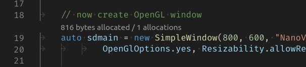

