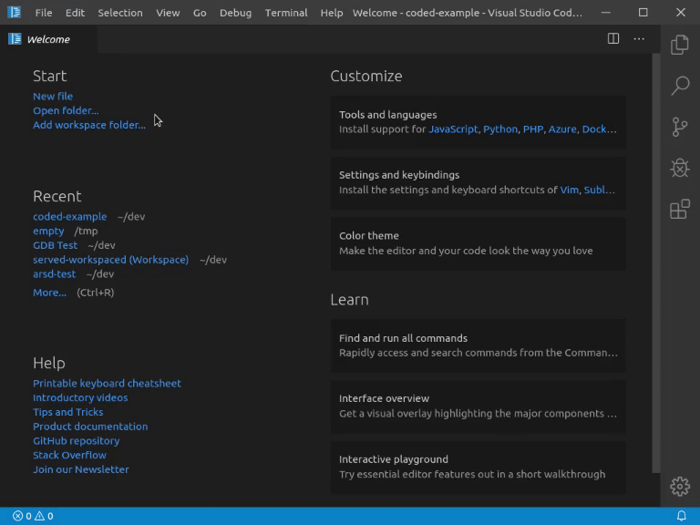
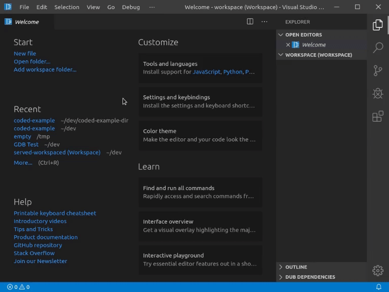

<!-- Documentation generated from docs-src/hello-world.md -->

# Tutorial

<div style="float: right; margin-left: 1em; padding: 1em; border: 1px solid white; position: relative; z-index: 10; outline: 1px solid black;">

* [Home](index.md)
* [Installation](install.md)
* [Tutorial](intro-to-d.md)
	* [Intro to D](intro-to-d.md)
	* **[Hello World](hello-world.md)**
	* [Building](building.md)
	* [Debugging](debugging.md)
	* [Editing](editing.md)
	* [DUB Package Manager](dub.md)
	* [vibe.d Web App](vibe-d.md)
	* [Configuring non-DUB projects](non-dub.md)
* [Troubleshooting](troubleshooting.md)
* [Changelog](../CHANGELOG.md)

</div>

## Hello World

### Opening a Workspace

To start with code-d you will first have to open a folder to work in. It's best if you select an empty folder for each project you are going to create. You can add multiple folders to your workspace in VSCode using `File -> Add Folder to Workspace...` too.

For a simple project opening a normal folder using the `Open Folder...` button is good enough.

Click `File -> Open Folder...` or `Ctrl-Shift-P -> Open Folder...` to open an empty folder as workspace for your project.



### Generating a Project using a Template



### Writing code

You can now start coding away. To make this hello world project actually work, insert the following code:

```d
import std.stdio;

void main()
{
	writeln("Hello World");
}
```

### Things to note

The example projects create a DUB project for you. (Noticable with the dub.json or dub.sdl file which is present at root level)

This means you have access to the whole [D package registry](https://code.dlang.org) and can use DUB as build tool too.

See [DUB homepage](https://dub.pm) for more information.

### Next Steps

Next you might want to check out the chapter [Building](building.md) to see how you can now run your application.

However if you don't want to use DUB for building and dependencies, check out [how to configure non-DUB projects](non-dub.md)

You might also want to explore the [Editor Features](editing.md) code-d has to offer.
